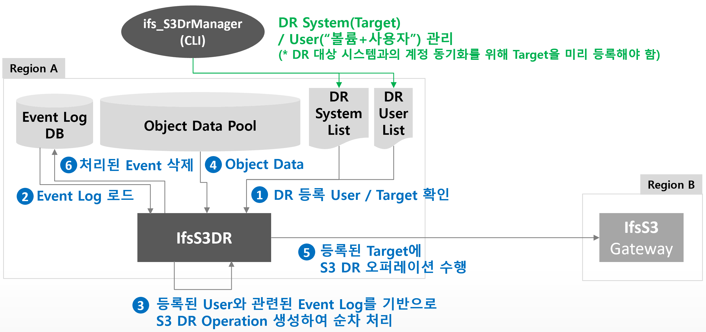

# IfsS3DR

## 용도
* 원격지에 구축된 InfiniStor 스토리지 시스템 간의 S3 호환 프로토콜 기반의 데이터(오브젝트) 동기화 솔루션

## 주요 기능
* InfiniStor 스토리지 시스템에 S3 API로 요청된 모든 오퍼레이션을 원격지의 InfiniStor 스토리지 시스템과 실시간 동기화 지원
* 볼륨+사용자 단위로 DR 활성화 / 비활성화 가능
* 버킷은 Versioning, ACL, CORS, Tagging, Encryption 정보를 동기화
* 오브젝트는 VersionId, ACL, Metadata,Tagging, DeleteMarker 정보를 동기화
* Dump기능을 사용하여 최초로 DR설정시 기존 버킷과 오브젝트에 대한 동기화가 가능


## 동작 방식



! DR 등록 User 확인은 10분당 1회 (기본값) <br>
! DR 대상 Event Log 확인 및 추출은 1초당 1회 (기본값)

## 관리 유틸리티

### Ifs Object Storage Auth(CLI) Usage
ifss-s3dr 프로그램의 서비스를 관리하는 유틸리티입니다.
``` shell
 # /usr/local/pspace/bin/ifs_objstorage_auth
Usage: ifs_objstorage_auth {init|start|stop|status} options

       init                                          : init s3dr service
       start                                         : start s3dr service
       stop                                          : stop s3dr service
       status                                        : show s3dr service status
       -h, --help                                    : show this help message and exit
```

- 서비스 시작 : <kbd>ifs_objstorage_auth start</kbd>
- 서비스 종료 : <kbd>ifs_objstorage_auth stop</kbd>
- 서비스 상태 확인 : <kbd>ifs_objstorage_auth status</kbd>

### ifs_S3DrManager(CLI) Usage
ifss-s3dr 프로그램의 설정을 관리하는 유틸리티입니다.
``` shell
# /usr/local/pspace/bin/ifs_S3DrManager
Usage: ifs_S3DrManager enable -V <Volume Name> -U <User Name> -D <Dump [yes|no]>   : Enable S3 DR User. Default Dump is 'no'
                       disable -V <Volume Name> -U <User Name>                     : Disable S3 DR User
                       update -V <Volume Name> -U <User Name> -D <Dump [yes|no]>   : Enable S3 DR User
                       list                                                        : Show Enabled S3 DR User List
                       addtarget   -T <Target Name> -I <Target ip>                 : Register S3 DR System
                       removetarget -T <Target Name>                               : Unregister S3 DR System
                       targetlist                                                  : Show S3 DR System List


Options:
  -h, --help            		show this help message and exit
  -V VOLUME, --Volume=VOLUME	Volume Name
  -U USER, --User=USER			User Name
  -D DUMP, --Dump=DUMP  		Enable/Disable Dump [yes|no]
  -T TARGET, --Target=TARGET 	S3 DR System Name
  -I IP, --Ip=IP        		S3 DR System Ip Address
```

#### DR Target 등록 / 등록 해제
* DR Target 등록
``` shell
ifs_S3DrManager addtarget -T <Target Name> -I <Target ip>
```
* DR Target 해제
``` shell
ifs_S3DrManager removetarget -T <Target Name>
```

#### DR 대상유저 등록 / 등록 해제
* DR 대상유저 등록
``` shell
ifs_S3DrManager enable -V <Volume Name> -U <User Name> -D <Dump [yes|no]> 
```
! 기존 데이터를 포함하여 동기화할 경우 –D yes로 등록

* DR 대상유저 등록 해제
``` shell
ifs_S3DrManager disable -V <Volume Name> -U <User Name>
```

## IfsS3DR의 Dump 기능
* IfsS3DR에 최초로 특정 “볼륨+사용자”유저를 DR로 설정(등록)할 때 활용이 가능한 옵션
* 기존 오브젝트에 대한 동기화가 필요할 경우 사용
* 기본적으로 버킷과 오브젝트의 설정 정보를 포함하여 동기화
* Dump기능을 No로 할 경우 기존에 존재하는 오브젝트는 무시하고 버킷만 동기화
* Dump기능을 Yes로 할 경우 기존에 존재하는 오브젝트의 버전 정보를 포함하여 동기화
* 다만 DeleteMaker에 대한 Dump기능은 현재 지원하지 않음

## 지원하는 DR Operation List
### DR Operation List (Bucket)
| Operation Name               | 비고 |
|------------------------------|----|
| PutBucket                    |    |
| Deletebucket                 |    |
| PutBucketVersioning          |    |
| PutBucketACL                 |    |
| PutCORSConfiguration         |    |
| DeleteCORSConfiguration      |    |
| PutBucketTagging             |    |
| DeleteBucketTagging          |    |
| PutLifecycleConfiguration    |    |
| DeleteLifecycleConfiguration |    |
| PutBucketPolicy              |    |
| DeleteBucketPolicy           |    |
| PutObjectLockConfiguration   |    |
| PutPublicAccessBlock         |    |
| DeletePublicAccessBlock      |    |
| PutBucketEncryption          |    |
| DeleteBucketEncryption       |    |
| PutBucketWebsite             |    |
| DeleteBucketWebsite          |    |

### DR Operation List (Object)
| Operation Name          | 비고                           |
|-------------------------|------------------------------|
| PutObject               |                              |
| CopyObject  | PutObject처럼 취급함              |
| DeleteObject            |                              |
| DeleteMaker             | DeleteObject의 VersionId포함 버전 |
| PutObjectACL            |                              |
| PutObjectTagging        |                              |
| DeleteObjectTagging     |                              |
| PutObjectRetention      |                              |
| PutObjectLegalHold      |                              |
| CompleteMultipartUpload | PutObject처럼 취급함              |

## Dependencies
* com.amazonaws
  - aws-java-sdk-bom : 1.11.837
  - aws-java-sdk-s3 : 1.11.837
* org.ini4j
  - ini4j : 0.5.4
* mysql
  - mysql-connector-java : 8.0.23
* com.fasterxml.jackson.core
  - jackson-databind : 2.11.1
* ch.qos.logback
  - logback-classic : 1.2.3
* org.slf4j
  - slf4j-api : 1.7.30
  - slf4j-simple : 1.7.30

## 구동 환경
- OS : CentOS 7.5 이상
- JDK : 1.8 이상
- IfsPortal : v436
- S3Proxy : 3.0B.0-2128M

## 알려진 이슈
- DeleteMarker는 Dump로 동기화 할 수 없습니다.

## 추가 예정
- Multi Target 기능
- 양방향 동기화 기능(S3Proxy에서 지원시 Source, Target 동시 동기화 가능)
- Dump에서 DeleteMarker 동기화 지원

## How to Build

### Maven 설치
* Maven이 설치되어 있는지 확인해야 합니다.

* <kbd>mvn -v</kbd> 로 설치되어 있는지 확인하세요.

* 설치가 되어 있지 않으면 다음 명령어로 설치를 해야 합니다. <br> 
<kbd>sudo apt install maven</kbd>

### Build
* pom.xml 파일이 있는 위치에서 <kbd>mvn package</kbd> 명령어를 입력하시면 빌드가 되고, 빌드가 완료되면 target이라는 폴더에 ifss-s3dr이 생성됩니다.

## How to Use (빌드한 경우)
1. Target폴더에 생성된 실행파일(ifss-s3dr)과 Resource 폴더의 설정파일(ifss-s3dr.conf, ifss-s3dr.service, ifss-s3dr.xml, install-service.sh) 원하는 위치로 이동
2. 프로그램 설정(ifss-s3dr.conf)
  - 세부 설정 방법은 ifss-s3dr.conf 파일 내에 기술되어 있습니다.
4. 로그설정(ifss-s3dr.xml) 및 로그파일의 경로 지정
``` xml
<!-- ifss-s3dr.xml -->
...
        <file>파일 경로</file>
...
            <fileNamePattern>파일경로 및 롤링 패턴</fileNamePattern>
...
```
ex>
``` xml
<!-- ifss-s3dr.xml -->
...
        <file>/var/log/s3dr/s3dr.log</file>
...
            <fileNamePattern>/var/log/s3dr/s3dr.log.%d{yyyy-MM-dd}.%i.log.gz</fileNamePattern>
...
```
4. ifss-s3dr.service에서 로그파일의 위치와 실행파일의 위치를 지정
``` ini
# ifss-s3dr.service
[Service]
ExecStart=/bin/bash -c "exec java -jar -Dlogback.configurationFile=`로그파일 경로` `실행파일 경로`"
```
ex >
``` ini
# ifss-s3dr.service
[Service]
ExecStart=/bin/bash -c "exec java -jar -Dlogback.configurationFile=/usr/local/pspace/etc/ifss-s3dr.xml /usr/local/pspace/bin/ifss-s3dr"
```
5. 서비스 등록
``` bash
install-service.sh
```
6. 서비스 시작
``` bash
systemctl start ifss-s3dr.service
```
